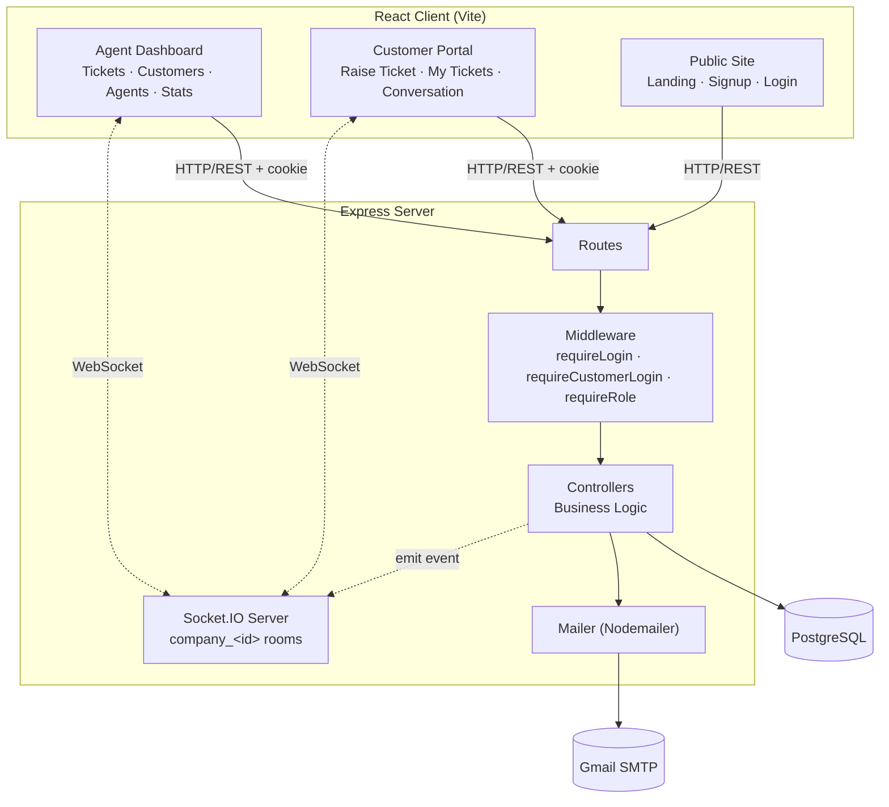
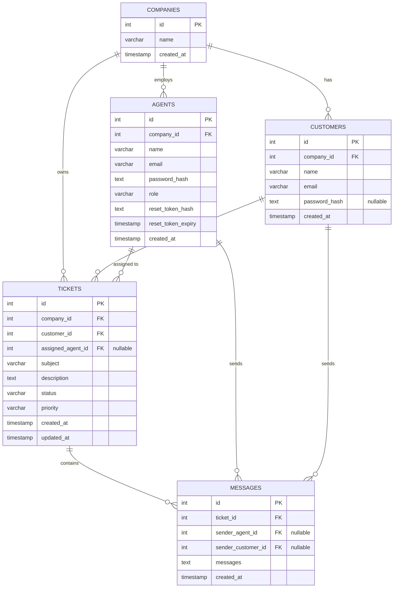
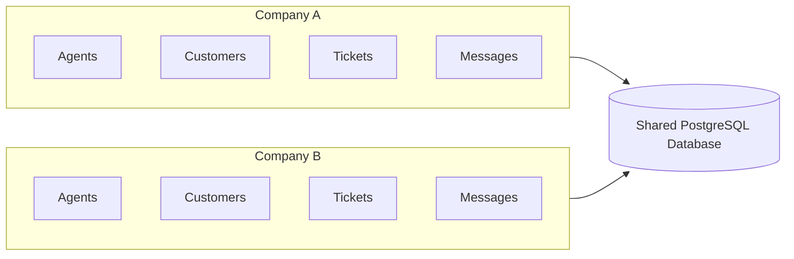
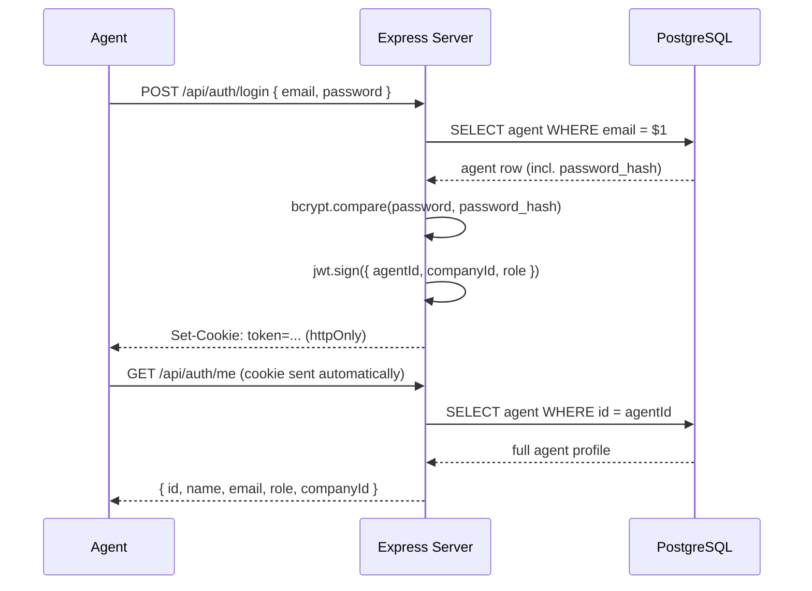
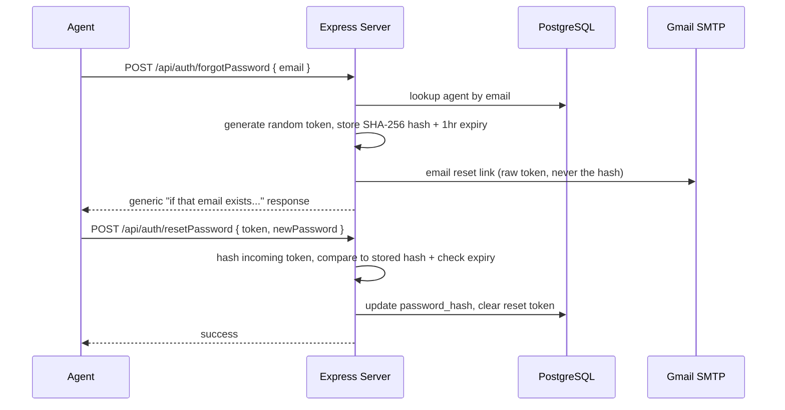
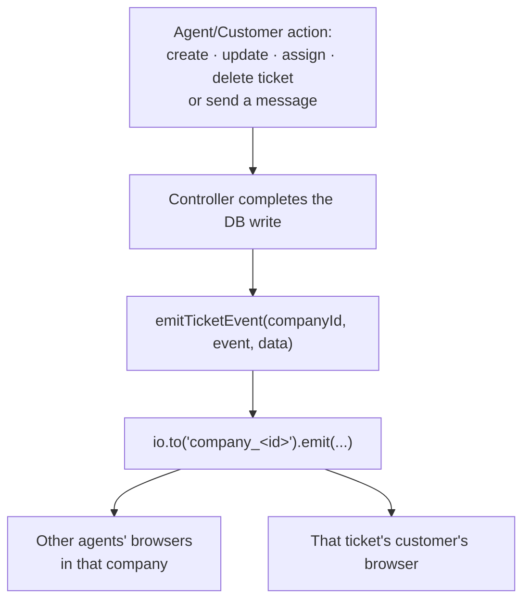

# ResolveHQ

**A full-stack, multi-tenant customer support platform** — agents and admins manage tickets, customers, and conversations from a shared dashboard, while customers get their own self-service portal to raise tickets and talk directly with support. Built to demonstrate production-style backend architecture, not just CRUD.


---

## Table of Contents

- [Overview](#overview)
- [Key Features](#key-features)
- [Architecture](#architecture)
- [Tech Stack](#tech-stack)
- [Database Schema](#database-schema)
- [Multi-Tenant Design](#multi-tenant-design)
- [Authentication](#authentication)
- [Real-Time Communication](#real-time-communication)
- [Email Notifications](#email-notifications)
- [API Reference](#api-reference)
- [Project Structure](#project-structure)
- [Getting Started](#getting-started)
- [Security Considerations](#security-considerations)
- [Known Limitations & Roadmap](#known-limitations--roadmap)
- [Engineering Concepts Demonstrated](#engineering-concepts-demonstrated)
- [Author](#author)

---

## Overview

ResolveHQ is a multi-tenant customer support and helpdesk platform. Multiple companies can use the same application and database while each company's agents, customers, tickets, and conversations stay completely isolated from every other company's.

The system is built around two separate applications sharing one backend:

- An **agent/admin dashboard** for managing tickets, customers, and teammates.
- A **customer portal** with its own signup and login, where customers can raise tickets and talk directly with the agent handling their case — updated in real time, with email notifications on both sides.

## Key Features

### Core Helpdesk (Agent/Admin)
- Company registration creates a tenant and its first admin in one step
- Ticket lifecycle: create, list (filterable by status/priority, searchable by subject, paginated), view, update status/priority, assign to an agent, delete
- Customer records: create, search, view, see a customer's full ticket history
- Agent management: add agents, promote/demote roles, admin-only
- Role-based dashboards: admins see company-wide stats, agents see their own assigned-ticket stats

### Customer Self-Service Portal
- Independent signup/login for customers — not the same auth system as agents
- A customer picks their company from a public directory at signup (no leaking of internal IDs)
- Raise a ticket directly (priority is intentionally not customer-settable — that's a triage decision for the support team)
- View their own ticket history and full conversation thread
- Reply directly to an agent on their own ticket

### Real-Time Updates (Socket.IO)
- Ticket create/update/delete and new messages broadcast live to everyone in that company
- No polling, no manual refresh needed to see a new reply or a status change

### Email Notifications (Gmail/Nodemailer)
- Password reset links (agents)
- Ticket-raised confirmation (customer)
- Ticket-assigned notification (agent)
- New-reply notification to the assigned agent when a customer responds

### Security & Access Control
- Separate JWT/cookie pairs for agent sessions vs. customer sessions — a customer token can never be mistaken for an agent token, or vice versa
- Every database query that touches company-owned data is scoped by `company_id` — there is no code path where changing an ID in a request exposes another tenant's data
- Passwords hashed with bcrypt, password-reset tokens stored as SHA-256 hashes with a 1-hour expiry, never the raw token

---

## Architecture



---

## Tech Stack

| Layer | Technology |
|---|---|
| Frontend | React, React Router, Axios, Vite, Context API |
| Backend | Node.js, Express.js, REST APIs |
| Real-time | Socket.IO |
| Database | PostgreSQL (foreign keys, composite unique constraints, cascading deletes, connection pooling) |
| Auth & Security | JWT, bcrypt, HTTP-only cookies, RBAC, CORS |
| Email | Nodemailer (Gmail SMTP) |

---

## Database Schema



**Notable design choices:**
- `customers.password_hash` is nullable on purpose — an agent can add a customer record before that customer ever signs up for the self-service portal themselves. Signup either creates a new row or "claims" an existing passwordless one.
- `agents.email` is globally unique (not per-company) since agents log in without selecting a company first; `customers.email` is unique **per company** (`UNIQUE(company_id, email)`), since the same person could be a customer of two different companies using this platform.
- `messages` has two nullable sender columns rather than a polymorphic sender — simple, explicit, and trivially distinguishes "who sent this" (`sender_agent_id IS NOT NULL` vs. `sender_customer_id IS NOT NULL`) without a join.
- `tickets.assigned_agent_id` is nullable — a customer-raised ticket starts unassigned until an admin assigns it.

---

## Multi-Tenant Design

Every company is a tenant. All companies share the same application instance and database, but a `company_id` column on every tenant-owned table — enforced at the query level, not just the UI — guarantees isolation:



The authenticated agent's `company_id` comes from their verified JWT, never from client input — so there is no request parameter a malicious or buggy client could send to read or modify another company's data. The same principle applies to customers: a customer's session carries their own `company_id` and `customer_id`, and every customer-facing query checks both before returning anything.

---

## Authentication

ResolveHQ runs **two entirely separate authentication systems** sharing one backend — intentionally, since an agent's and a customer's identity, permissions, and session lifecycle are fundamentally different things.

| | Agents | Customers |
|---|---|---|
| Cookie name | `token` | `customer_token` |
| JWT payload | `{ agentId, companyId, role }` | `{ customerId, companyId, type: "customer" }` |
| Middleware | `requireLogin` | `requireCustomerLogin` |
| Identifies company by | Already an employee of one | Chosen from a public dropdown at signup |

### Agent login flow



### Password reset flow



The response to `forgotPassword` is identical whether or not the email exists, and the raw token is never stored — only its hash — so a database leak alone can't be used to reset anyone's password.

---

## Real-Time Communication

Each authenticated socket joins a room named `company_<id>`. Server-side controllers emit directly into that room after any state change, so every connected client for that company — agent or customer — receives it instantly.



**Events emitted:** `ticket:created`, `ticket:updated`, `ticket:deleted`, `ticket:message`.

Clients append incoming messages with duplicate-protection (checked by message `id`), so a sender's own action — which already updates their local state via the API response — never results in a visible duplicate when the broadcast echoes back to their own socket.

---

## Email Notifications

A single shared `mailer.js` utility wraps one Gmail/Nodemailer transporter, reused by every notification type. A failed send is always logged and swallowed — a flaky email provider should never break the ticket action that triggered it.

| Trigger | Recipient | Notification |
|---|---|---|
| Agent requests password reset | Agent | Reset link (1-hour expiry) |
| Customer raises a ticket | Customer | "We've received your ticket" |
| Admin assigns a ticket | Assigned agent | "A new ticket has been assigned to you" |
| Customer replies to a ticket | Assigned agent (if any) | "New reply on ticket..." with a preview |

---

## API Reference

### Auth — Agents (`/api/auth`)
| Method | Path | Auth | Description |
|---|---|---|---|
| POST | `/signup` | — | Register a company + its first admin |
| POST | `/login` | — | Agent login, sets `token` cookie |
| POST | `/logout` | — | Clears the agent session |
| GET | `/me` | Agent | Current agent's full profile |
| POST | `/forgotPassword` | — | Request a password reset email |
| POST | `/resetPassword` | — | Reset password with a valid token |

### Auth — Customers (`/api/customer-auth`)
| Method | Path | Auth | Description |
|---|---|---|---|
| POST | `/signup` | — | Customer signup (creates or claims a customer record) |
| POST | `/login` | — | Customer login, sets `customer_token` cookie |
| POST | `/logout` | — | Clears the customer session |
| GET | `/me` | Customer | Current customer's profile |

### Companies (`/api/companies`)
| Method | Path | Auth | Description |
|---|---|---|---|
| GET | `/` | — | Public list of companies (id + name only), powers the customer signup dropdown |

### Tickets (`/api/tickets`) — Agent-facing
| Method | Path | Auth | Description |
|---|---|---|---|
| POST | `/createTickets` | Agent | Create a ticket (auto-assigned to creator) |
| GET | `/` | Agent | List tickets — filterable, searchable, paginated; agents see only their own, admins see all |
| GET | `/:id` | Agent | Get a single ticket |
| PATCH | `/:id` | Agent | Update status/priority |
| PATCH | `/:id/assign` | Admin | Assign a ticket to an agent |
| DELETE | `/:id` | Admin | Delete a ticket |

### Customer Portal (`/api/customer-portal`) — Customer-facing
| Method | Path | Auth | Description |
|---|---|---|---|
| POST | `/tickets` | Customer | Raise a ticket (unassigned, no priority input) |
| GET | `/tickets` | Customer | List the customer's own tickets |
| GET | `/tickets/:id` | Customer | View one of their own tickets |
| GET | `/tickets/:id/messages` | Customer | View that ticket's conversation |
| POST | `/tickets/:id/reply` | Customer | Reply on their own ticket |

### Customers (`/api/customer`) — Agent-facing
| Method | Path | Auth | Description |
|---|---|---|---|
| POST | `/create` | Agent | Add a customer record |
| GET | `/` | Agent | List/search company customers |
| GET | `/:id` | Agent | View a customer |
| GET | `/:id/tickets` | Agent | That customer's ticket history |

### Agents (`/api/agents`)
| Method | Path | Auth | Description |
|---|---|---|---|
| POST | `/createAgent` | Admin | Add a new agent |
| GET | `/allAgents` | Admin | List company agents |
| PATCH | `/:id` | Admin | Update an agent's name/role |

### Messages (`/api/response`) — Agent-facing conversation
| Method | Path | Auth | Description |
|---|---|---|---|
| POST | `/replyMessage/:id` | Agent | Reply on any ticket in the company |
| GET | `/allMessages/:id` | Agent | View a ticket's conversation |

### Stats (`/api/stats`)
| Method | Path | Auth | Description |
|---|---|---|---|
| GET | `/stats` | Admin | Company-wide ticket counts by status |
| GET | `/agentStats` | Agent | The agent's own assigned-ticket counts |

---

## Project Structure

```
ResolveHQ/
│
├── resolvehq-frontend/
│   └── src/
│       ├── api/              # One module per backend resource (axios wrappers)
│       ├── components/       # Sidebar, Navbar, Badges, TicketList, ProtectedRoute, etc.
│       ├── context/          # AuthContext, CustomerAuthContext, ToastContext
│       ├── pages/            # Dashboard, Tickets, Customers, Agents, CustomerPortal, etc.
│       ├── socket.js         # Shared Socket.IO client
│       ├── App.jsx
│       └── index.css         # Design tokens + shared component styles
│
├── src/
│   ├── controllers/          # One file per resource
│   ├── routes/                # One file per resource
│   ├── middlewares/           # requireLogin, requireCustomerLogin, requiresRole
│   ├── utils/
│   │   └── mailer.js          # Shared Nodemailer transporter
│   ├── socket.js              # Socket.IO server, room management, emitTicketEvent
│   ├── db/pool.js
│   └── database/schema.sql
│
├── index.js                   # Server entry point
├── package.json
└── README.md
```

---

## Getting Started

### Prerequisites
Node.js, npm, PostgreSQL, Git.

### 1. Clone and install
```bash
git clone https://github.com/Yashk879/ResolveHQ.git
cd ResolveHQ
npm install
cd resolvehq-frontend && npm install && cd ..
```

### 2. Backend environment variables (`.env` in project root)
```env
DB_USER=your_postgres_user
DB_PASSWORD=your_postgres_password
DB_HOST=localhost
DB_PORT=5432
DB_NAME=resolveHQ

JWT_SECRET=your_jwt_secret
NODE_ENV=development

GMAIL_USER=youraddress@gmail.com
GMAIL_APP_PASSWORD=your_16_char_app_password

FRONTEND_URL=http://localhost:5173
```
`GMAIL_APP_PASSWORD` requires 2-Step Verification enabled on the Google account, then generating an app password at `myaccount.google.com/apppasswords`.

### 3. Frontend environment variables (`resolvehq-frontend/.env`)
```env
VITE_API_URL=http://localhost:3000/api
```

### 4. Database setup
```sql
CREATE DATABASE "resolveHQ";
```
Then run `src/database/schema.sql` against it to create all tables.

### 5. Run it
```bash
# Terminal 1 — backend
node index.js

# Terminal 2 — frontend
cd resolvehq-frontend
npm run dev
```

Never commit a real `.env` file — rotate any secret that's ever been pasted somewhere outside your own machine.

---

## Security Considerations

- Passwords hashed with bcrypt (cost factor 10), never stored or logged in plaintext
- JWTs stored in `httpOnly` cookies — inaccessible to client-side JavaScript, mitigating XSS-based token theft
- Password reset tokens are single-use, expire after 1 hour, and only their SHA-256 hash is ever persisted
- Every company-scoped query filters by the authenticated identity's `company_id` — never by a client-supplied ID
- Role-based middleware (`requiresRole("admin")`) enforced server-side; the frontend hides admin-only UI for agents as a UX nicety, not as the actual security boundary
- `cookie-parser` + `express.json()` with a locked-down CORS origin

## Known Limitations & Roadmap

Being transparent about what's not here yet:

- **No automated test suite** — the next highest-priority addition
- **No CI/CD pipeline** — tests, if added, currently only run manually
- **Not yet deployed** — runs locally; needs a hosted Postgres + backend + frontend before it's demonstrable as a live product
- **No rate limiting** on auth endpoints, which matters more now that customer signup/login are public, internet-facing routes
- **Manual schema migrations** — changes are applied by hand via `ALTER TABLE`, no migration tool in place
- **No file attachments** on tickets/messages
- **No production observability** — no error tracking or structured logging beyond `console.error`

Planned next: automated tests around auth and tenant isolation (the project's core differentiators), a CI pipeline, and a production deployment.

## Engineering Concepts Demonstrated

**Backend:** REST API design, Express middleware chains, two parallel authentication systems, role-based authorization, connection pooling, environment-based configuration, cookie-based sessions, transactional signup (company + admin created together).

**Database:** PostgreSQL relational design, foreign keys, composite unique constraints (`UNIQUE(company_id, email)`), cascading vs. `SET NULL` deletes, tenant-aware queries, derived (non-stored) fields via `LEFT JOIN LATERAL`.

**Frontend:** React Context for dual auth state, protected/guest/role-gated routing, a from-scratch design system (not a component library default), optimistic + real-time state reconciliation, toast-based feedback.

**System design:** Multi-tenant architecture, separation of concerns across routes/middleware/controllers, real-time event broadcasting scoped to tenant boundaries, graceful degradation (a failed email never blocks the action that triggered it).

---

## Author

**Yash Kumar**
GitHub: [github.com/Yashk879](https://github.com/Yashk879)

## License

Available for educational and portfolio purposes. Licensing terms may be updated as the project evolves.
